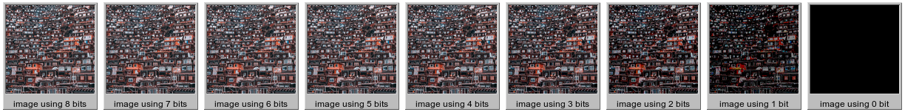
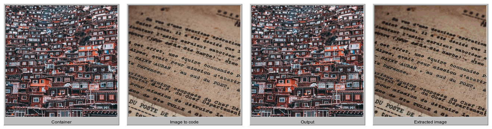

# Steganography

```
┏━┓╺┳╸┏N╸┏━╸┏O┓┏┓╻┏━┓┏E╸┏E┓┏━┓┏E┓╻ ╻╻ ╻       
┗━┓ A ┣╸ ┃╺┓┣━┫┃U┫┃ ┃┃╺┓┣┳┛┣M┫┣━┛┣?┫┗┳┛             Hide an Image within another
┗━C ╹ ┗━╸┗Y┛╹ ╹╹ ╹┗S┛┗━┛╹┗╸╹ ╹╹  ╹ ╹ ╹ .py
```

Coding an image within another by compositing high-order bits of each image.

As seen below 4 high-order bit of each pixel of an image contain most if the details about it:



We can remove 4 low-order bits and replace them with 4 high-order bits of another image. so we would easily be able to hide an image within another and still got most of the details.

so here we use an image as container also called `container.png` and another one as the data to be code inside it called `containee.png` to produce and image looking exactly like container bot have the containee image inside, hidden:



## Usage

Create a virtualenv and install required packages:

```shell
virtualenv venv
source venv/bin/activate
pip install -r requirements.txt
```

then, Encode images or Decode with:

```shell
# Encode
python steganography.py <encode> <container_image_path> <containee_image_path>

# Decode
python steganography.py <decode> <image_path>
```

see `--help` for more options.

